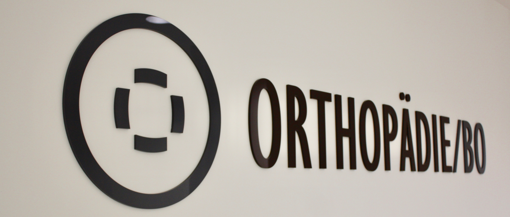

### **Operative und konservative Orthopädie und Unfallchirurgie**

### Sportmedizin

### Chirotherapie

### Kinderorthopädische Sprechstunde incl. Sonografie der Säuglingshüfte

### Diagnostik:

- Modernes digitales Röntgen
- Knochendichtemessung (DEXA)
- Ultraschall (Bewegungsapparat und Säuglingshüfte)
- Elektromyografie (EMG)
- Ganganalyse
- Fußdruckmessung

### Interventionelle Schmerztherapie:

- Infiltrationen
- Röntgen-kontrollierte Infiltrationen
- Akupunktur
- Axomera
- Molekular-medizinische Behandlungen (z.B. Hyalart, ACP, Infusionen)
- Neuraltherapie

### Physikalische Therapie

- Magnetodyn-Therapie
- Dynamische Tiefenwellen (Stima WELL)
- Lasertherapie
- Stoßwellen-Therapie
- Turbosonic (Whole Body vibration)
- Ultrakurzwellentherapie
- TENS (transdermale elektrische Nervenstimulation)
- Extrakorporale Stoßwellentherapie
